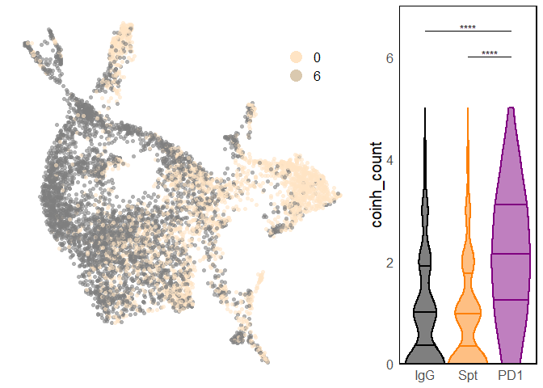
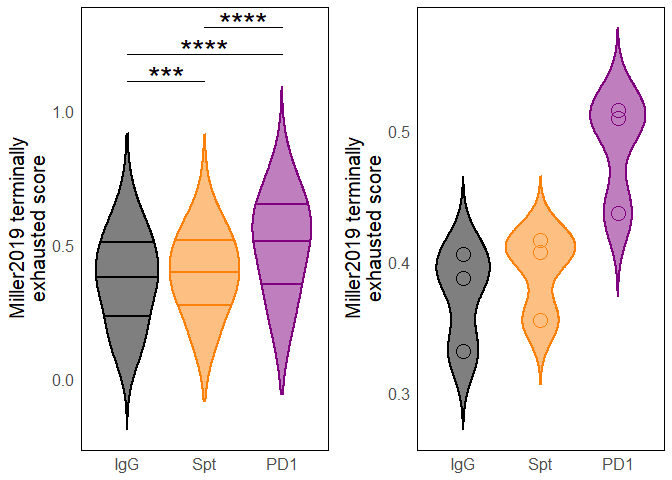

3_figure2_plots
================
2022-07-10

The purpose of this figure is to show that CD8+ T cells in the pancreas
show a gain in proliferation, gain in exhaustion-like features, and loss
of memory-like features in checkpoint-induced T1D compared to
spontaneous T1D.

``` r
require(tidyr, quietly = T) #pivot_wider function
require(dplyr, quietly = T) #simple manipulation of data.frames
require(Seurat, quietly = T) #scRNA-seq analysis
require(cowplot, quietly = T) #plot_grid function
require(reshape, quietly = T) #melting and casting data.frames
require(ggplot2, quietly = T) #plotting
require(rstatix, quietly = T) #adding p values to plots
require(ggprism, quietly = T) #adding p values to plots
require(ggsci, quietly = T) #IGV color palette
require(patchwork, quietly = T) #adding p values to plots
require(magrittr, quietly = T) #adding p values to plots
require(gridExtra, quietly = T) #display multiple plots
require(ggrepel, quietly = T) #labels for plots
require(tibble, quietly = T) #rownames_to_column function and deframe in GSEA analysis
require(presto, quietly = T) #wilcoxauc quicker test for GSEA analysis across treatment groups
require(msigdbr, quietly = T) #access to msigdb gene signatures
require(fgsea, quietly = T) #GSEA analysis
require(useful, quietly = T) #corner function to peek at data.frames
require(viridis, quietly = T) #viridis color palettes
require(readxl, quietly = T) #reading Excel files
require(msigdbr, quietly = T) #accessing gene signatures from mSigDB
source("scripts/utils.R") #custom color palettes and other functions
set.seed(1) #set a seed for reproducibility
```

Read in the integrated seurat object containing CD4+ and CD8+ T cells
from all tissues and the T cells only the pancreas:

``` r
seurat_integrated <- readRDS("objects/seurat_integrated_clustered.rds") #all T cells from all tissues
pan8 <- readRDS("objects/seurat_cd8_panonly_clustered.rds") #CD8+ T cells from pancreas only
pan4 <- readRDS("objects/seurat_cd4_panonly_clustered.rds") #CD4+ T cells from pancreas only
```

The purpose of these figures are to show that PD-1 blockade promotes
CD8+ T cell clonal expansion, loss of a memory-like subset, and
exhaustion-like transcriptional features in NOD pancreas.

``` r
pan8_cls <- pan8@meta.data %>% 
              dplyr::select(UMAP_1, UMAP_2, seurat_clusters) %>% 
              group_by(seurat_clusters) %>% 
              summarise(U1 = mean(UMAP_1), U2 = mean(UMAP_2)) %>% 
              data.frame()

p_cd8_panonly_cluster <- pan8@meta.data %>% 
                            ggplot(aes(x = UMAP_1, 
                                     y = UMAP_2, 
                                     color = seurat_clusters)) + 
                            geom_point(shape = 16, 
                                       alpha = 0.6) +
                            theme_minimal() +
                            theme(axis.title = element_blank(),
                                  axis.text = element_blank(),
                                  text = element_text(size = 15),
                                  panel.grid = element_blank(),
                                  legend.position = "none") +
                            labs(x = 'UMAP 1', 
                                 y = 'UMAP 2', 
                                 color = "Seurat clusters",
                                 size = "Size of clonotype\n(pancreas only)") +
                            scale_alpha_continuous(range = c(0.4,1)) +
                            scale_size_continuous(range = c(1,3)) +
                            # geom_label_repel(data = pan8_cls, #change depending on Seurat used
                            #      mapping = aes(x = U1,
                            #                    y = U2, 
                            #                    label = seurat_clusters), 
                            #      size = 5, 
                            #      min.segment.length = Inf, 
                            #      show.legend = FALSE) +
                            guides(color = guide_legend(override.aes = list(alpha=1, 
                                                                          size=5, 
                                                                          shape=19)), 
                                   size = guide_legend()) +
                            scale_color_manual(values = custom_colors("clusters"),
                                               limits = force) #drops unused clusters in legend

p_cd8_panonly_treatments <- pan8@meta.data %>% 
                              ggplot(aes(x = UMAP_1, 
                                       y = UMAP_2, 
                                       color = seurat_clusters,
                                       size = pan_clonotype_count)) + 
                              geom_point(data = pan8@meta.data %>%
                                           dplyr::select(-treatment), 
                                           shape = 16,
                                           color = "grey90") +
                              geom_point(shape = 16, 
                                         alpha = 0.6) +
                              theme_minimal() +
                              theme(axis.title = element_blank(),
                                    strip.text = element_blank(),
                                    axis.text = element_blank(),
                                    text = element_text(size = 15),
                                    panel.grid = element_blank()) +
                              labs(x = 'UMAP 1', 
                                   y = 'UMAP 2', 
                                   color = "Seurat clusters",
                                   size = "Size of clonotype\n(pancreas only)") +
                              scale_alpha_continuous(range = c(0.4,1)) +
                              scale_size_continuous(range=c(1,3)) +
                              facet_wrap(~treatment) +
                              scale_color_manual(values = custom_colors("clusters"),
                                                 limits = force, #drops unused clusters in legend
                                                 guide = "none") 

grid.arrange(p_cd8_panonly_cluster, p_cd8_panonly_treatments, widths = c(1,3))
```

    ## Warning: Removed 7968 rows containing missing values (geom_point).

    ## Warning: Removed 2656 rows containing missing values (geom_point).

<!-- -->

Next, a stacked bar plot of the treatment group distribution within each
seurat cluster:

``` r
p_treatment_per_seurat_cluster <- pan8@meta.data %>% 
    ggplot(aes(x = factor(seurat_clusters, 
                        levels = rev(levels(pan8$seurat_clusters))), 
                        fill = treatment)) + 
    geom_bar(stat = "count", 
             position = "fill") + 
    scale_x_discrete(expand = c(0,0)) +
    scale_y_continuous(labels = scales::percent_format(accuracy = 1), 
                       expand=c(0,0)) +
    theme_minimal() +
    theme(panel.grid = element_blank(),
          text = element_text(size = 15),
          legend.position = "right") +
    labs(title = "CD8+ T cells in the pancreas", 
         y = "Percent of Seurat Cluster", 
         x = NULL,
         color = "Tissue") +
    scale_fill_manual(values = custom_colors("treatments")) +
    coord_flip()
p_treatment_per_seurat_cluster
```

<!-- -->

Bar chart showing the difference in the seurat clusters within each
treatment group by each mouse. This is also shown by Fishers Exact test.

``` r
p_seurat_cluster_per_treatment <- pan8@meta.data %>%
                                    group_by(treatment, mouse_id, seurat_clusters) %>%
                                    tally() %>%
                                    group_by(treatment,mouse_id) %>%
                                    mutate(prcnt = n*100/sum(n)) %>%
                                    ggplot(aes(x = factor(seurat_clusters,
                                                          levels = rev(levels(pan8$seurat_clusters))),
                                               fill = treatment,
                                               y = prcnt)) +
                                    geom_violin(position = position_dodge(0.9),
                                                scale = "width",
                                                adjust = 1) +
                                    facet_wrap(~ seurat_clusters,
                                               nrow = 1,
                                               scales = "free_x") +
                                    scale_x_discrete(expand = c(0,0)) +
                                    scale_y_continuous(expand=c(0,0)) +
                                    theme_minimal() +
                                    theme(panel.grid = element_blank(),
                                          text = element_text(size = 15),
                                          legend.position = "right",
                                          panel.spacing = unit(0, "lines"),
                                          panel.border = element_rect(fill = NA, color = "black", size = 1)) +
                                    labs(title = "CD8+ T cells in the pancreas",
                                         y = "Percent of Seurat Cluster",
                                         x = NULL,
                                         color = "Tissue") +
                                    scale_fill_manual(values = custom_colors("treatments"))
p_seurat_cluster_per_treatment
```

<!-- -->

A volcano plot shows the DE genes between the PD1 and Spt treatment
groups:

``` r
cutoff <- 0.25 #set a cutoff for DE gene expression
ident1 <- "PD1"
ident2 <- "Spt"

Idents(pan8) <- pan8$treatment
volcanodata <- FindMarkers(pan8, #define the table of DE genes
                       ident.1 = ident1,
                       ident.2 = ident2, 
                       verbose = F,
                       only.pos = F, 
                       logfc.threshold = cutoff, 
                       assay = "RNA")
volcanodata$gene <- rownames(volcanodata) #rownames are genes
corner(volcanodata)
```

    ##                  p_val avg_log2FC pct.1 pct.2     p_val_adj
    ## Mbd2     6.855408e-261  1.3919770 0.649 0.138 7.764435e-257
    ## Tle5     2.477759e-222  1.1735510 0.885 0.465 2.806310e-218
    ## Hsp90ab1 3.452189e-140 -0.8637080 0.912 0.951 3.909949e-136
    ## Pcbp1    3.254960e-132  0.9228640 0.546 0.176 3.686568e-128
    ## Zdhhc18  2.147971e-130  0.8690588 0.502 0.146 2.432792e-126

``` r
#assess significance
volcanodata$DE <- 'None' #set all significance to none
volcanodata[which(volcanodata$p_val_adj < 0.05 & volcanodata$avg_log2FC >= cutoff),"DE"] <- ident1 #positive avg_log2FC are associated with ident.1
volcanodata[which(volcanodata$p_val_adj < 0.05 & volcanodata$avg_log2FC <= -cutoff),"DE"] <- ident2 #negative avg_log2FC are associated with ident.2

#label individual genes
delabels <- volcanodata %>% filter(DE != 'None') %>% group_by(DE) #only label significant genes
#delabels <- delabels %>% filter(gene %in% goi) #filter based on genes of interest

volcanodata %>%
    ggplot(aes(x = avg_log2FC,
               y = -log10(p_val_adj))) + 
        geom_hline(yintercept = -log10(0.05),
                   size = 0.5,
                   color = "grey90",
                   alpha = 0.5) + 
        geom_vline(xintercept = c(-cutoff, cutoff),
                   size = 0.5,
                   color = "grey90",
                   alpha = 0.5) + 
        geom_point(aes(color = DE),
                   size = 3,
                   alpha = 0.5,
                   shape = 16) +
        scale_color_manual(values = c("None" = "grey70",
                                      custom_colors("treatments"))) +
        scale_y_continuous(limits = c(0,125)) +
        theme_minimal() +
        theme(panel.grid = element_blank(),
              text = element_text(size = 15),
              axis.text = element_text(), 
              axis.title = element_text()) +
        labs(x = paste("Average Log2 Fold Change (",ident1,"/",ident2,")"),
             y = expression(-log[10]~(Adjusted~p~Value)),
             title="CD8+ T cells in pancreas of Spt") +
        geom_label_repel(data = delabels,
                         aes(x = avg_log2FC,
                             y = -log10(p_val_adj),
                             label = gene,
                             color = DE),
                         label.size = NA,
                         label.padding = 0.2, 
                         na.rm = TRUE,
                         fill = alpha(c("white"), 0.8), 
                         size=7, 
                         max.overlaps = 50)
```

    ## Warning: Removed 5 rows containing missing values (geom_point).

    ## Warning: ggrepel: 274 unlabeled data points (too many overlaps). Consider
    ## increasing max.overlaps

<!-- -->

Show the top 50 clonotypes as a percentage of TCRs detected as a
cumulative sum. The clone sizes for the different treatment groups are
also plotted. The diversity analysis is done by calculating the Simpson
index without replacement, as it is less affected by differences in the
absolute number of cells:

``` r
## TOP 50 CLONOTYPES
cumulative_sums <- pan8@meta.data %>% filter(!is.na(clonotype_id)) %>% 
                      group_by(treatment, clonotype_id, pan_clonotype_count) %>% 
                      tally() %>% 
                      group_by(treatment) %>% 
                      mutate(prcnt = n*100/sum(n)) %>% 
                      group_by(treatment) %>% 
                      arrange(treatment, desc(prcnt)) %>% 
                      mutate(cs = cumsum(prcnt))

cumulative_sums$clonotype_id <- factor(cumulative_sums$clonotype_id, 
                                       levels = cumulative_sums$clonotype_id)

p_top50_clonos <- cumulative_sums %>% 
                    group_by(treatment) %>% 
                    slice_head(n = 50) %>% 
                    ggplot(aes(x = clonotype_id, 
                               y = cs, 
                               color = treatment)) + 
                    geom_point() + 
                    geom_segment(aes(xend = clonotype_id, 
                                     yend = cs, 
                                     x = clonotype_id, 
                                     y = 0, 
                                     color = treatment)) + 
                    scale_color_manual(values = custom_colors("treatments")) +
                    scale_y_continuous(expand = c(0, 0), 
                                       limits = c(0, 80)) +
                    theme_minimal() +
                    theme(panel.grid = element_blank(),
                          panel.spacing.x = unit(0, "lines"),
                          text = element_text(size = 15),
                          axis.text.x = element_blank(),
                          panel.border = element_rect(colour = "black", 
                                                      fill = NA, 
                                                      size = 1),
                          legend.position = "none") +
                    labs(x = "Top 50 clonotypes", 
                         y = "Cumulative % CD8 TCRs") +
                    facet_wrap(~ treatment, scales = "free_x")
p_top50_clonos
```

<!-- -->

``` r
## BOXPLOT OF CLONE SIZE
stat.test <- data.frame(pan8@meta.data %>%
                          dplyr::select(treatment, clonotype_id, pan_clonotype_count) %>%
                          unique() %>%
                          wilcox_test(pan_clonotype_count ~ treatment) %>% 
                          add_xy_position() %>%
                          mutate(y.position = log10(y.position + 1)))

p_boxplot_clone_size <- pan8@meta.data %>%
                          dplyr::select(treatment, clonotype_id, pan_clonotype_count) %>%
                          unique() %>%
                          ggplot() + 
                          geom_boxplot(aes(x = treatment, 
                                     y = log10(pan_clonotype_count), 
                                     fill = treatment,
                                     color = treatment),
                                     outlier.shape = NA, 
                                     alpha = 0.5) +
                          geom_point(aes(x = treatment, 
                                     y = log10(pan_clonotype_count+1), 
                                     fill = treatment,
                                     color = treatment),
                                     position = position_jitter(0.2),
                                     alpha = 0.1) +
                          scale_fill_manual(values = custom_colors("treatments")) +
                          scale_color_manual(values = custom_colors("treatments")) +
                          theme_minimal() +
                        scale_y_continuous(limits = c(0, 2.9)) +
                          theme(panel.grid = element_blank(),
                                axis.title.x = element_blank(),
                                legend.position = "none",
                                text = element_text(size = 15),
                                panel.border = element_rect(colour = "black", fill=NA, size=1)) +
                          labs(y = expression(log[10](clone~size)),
                               color = "Treatment",
                               fill = "Treatment") +
                          add_pvalue(stat.test,
                                     label = "p.adj.signif",
                                     step.increase = 0.05,
                                     tip.length = 0,
                                     label.size = 7) 

grid.arrange(p_top50_clonos, p_boxplot_clone_size, widths = c(2,1))
```

    ## Warning: Removed 42 rows containing non-finite values (stat_boxplot).

    ## Warning: Removed 42 rows containing missing values (geom_point).

<!-- -->

``` r
#DIVERSITY ANALYSIS
tcrtypecounts <- rbind(data.frame(pan8@meta.data %>% dplyr::select(treatment, mouse_id, clonotype_id, clonotype_count)))
corner(tcrtypecounts)
```

    ##                          treatment mouse_id  clonotype_id clonotype_count
    ## pan_PD1_AAACCTGTCAGCACAT       PD1    PD1_2          <NA>              NA
    ## pan_PD1_AAACGGGGTCAGTGGA       PD1    PD1_1          <NA>              NA
    ## pan_PD1_AAACGGGGTCATATGC       PD1    PD1_3   clonotype57              27
    ## pan_PD1_AAACGGGGTGGTCTCG       PD1    PD1_3 clonotype7147               1
    ## pan_PD1_AAACGGGTCCTTGCCA       PD1    PD1_1   clonotype25              50

``` r
tcrtypecounts <- tcrtypecounts %>% filter(!is.na(clonotype_id)) %>% cast(treatment + mouse_id  ~ clonotype_id)
```

    ## Using clonotype_count as value column.  Use the value argument to cast to override this choice

    ## Aggregation requires fun.aggregate: length used as default

``` r
corner(tcrtypecounts)
```

    ##   treatment mouse_id clonotype1 clonotype10 clonotype1000
    ## 1       IgG    IgG_1        234           0             0
    ## 2       IgG    IgG_2          0           0             0
    ## 3       IgG    IgG_3          0           0             0
    ## 4       Spt    Spt_1          0           0             0
    ## 5       Spt    Spt_2          0           0             0

``` r
totalN <- tcrtypecounts %>% dplyr::select(-c(treatment, mouse_id)) %>% rowSums() # Total N by row sums
df <- sapply(tcrtypecounts %>% dplyr::select(-c(treatment, mouse_id)), function(x) (x - 1)*x) # Calculate x(x-1) for each value in df
corner(df)
```

    ##      clonotype1 clonotype10 clonotype1000 clonotype101 clonotype102
    ## [1,]      54522           0             0            0            0
    ## [2,]          0           0             0            0           42
    ## [3,]          0           0             0            0            0
    ## [4,]          0           0             0          210            0
    ## [5,]          0           0             0            0            0

``` r
numerator <- df %>% rowSums() # Calculate numerator of equation (x in above)

# Calculate simpson index
diversities <- data.frame(tcrtypecounts %>% 
                            dplyr::select(c(treatment, mouse_id)), 
                          celltype = "CD8", 
                          simpson = totalN*(totalN - 1) / numerator)

diversities$treatment <- factor(diversities$treatment, levels = c("IgG", "Spt", "PD1")) #factor the pathologies

stat.test <- data.frame(diversities %>% 
                            mutate(simpson = ifelse(simpson == Inf, NA, simpson)) %>% 
                            wilcox_test(simpson ~ treatment) %>% 
                            add_xy_position())

diversities %>%
    ggplot(aes(x = treatment, 
               y = simpson,
               fill = treatment, 
               color = treatment)) + 
    geom_violin(alpha = 0.5,
                adjust = 1,
                scale = "width",
                trim = F) + 
    geom_point(size = 5) +
    labs(y = "Simpson index") +
    theme_minimal() +
    theme(panel.grid = element_blank(),
          text = element_text(size = 15),
          panel.border = element_rect(colour = "black", 
                                      fill = NA, 
                                      size = 1),
          legend.position = "bottom") +
    labs(title = "CD8 T cells in pancreas") +
    scale_fill_manual(values = custom_colors("treatments")) +
    scale_color_manual(values = custom_colors("treatments")) +
    add_pvalue(stat.test,
               inherit.aes = F,
               label = "p.adj.signif",
                y.position = "y.position") 
```

<!-- -->

There is an outstanding question in the field as to whether diabetogenic
T cells become exhausted in the pancreas. To explore this, co-inhibitory
receptor expression is examined, in addition to expression of an
exhaustion-associated gene signature:

``` r
p_cd8_panonly_coinh_umap <- pan8@meta.data %>% 
                        ggplot(aes(x = UMAP_1, 
                                   y = UMAP_2, 
                                   color = factor(coinh_count))) + 
                        geom_point(shape = 16,
                                   alpha = 0.6) +
                        theme_minimal() +
                        theme(axis.title = element_blank(),
                              axis.text = element_blank(),
                              text = element_text(size = 15),
                              legend.position = c(0.85,0.85),
                              panel.grid = element_blank()) +
                        labs(x = 'UMAP 1', 
                             y = 'UMAP 2',
                             color = NULL) +
                        guides(color = guide_legend(override.aes = list(alpha=1, 
                                                                        size=5, 
                                                                        shape=19)), 
                               size = guide_legend()) +
                        scale_color_manual(values = scales::seq_gradient_pal("#ffe4c4", "#2f4f4f", "Lab")(seq(0,1,length.out=7)), limits = c(0,6))
```

    ## Warning: Continuous limits supplied to discrete scale.
    ## Did you mean `limits = factor(...)` or `scale_*_continuous()`?

``` r
stat.test <- data.frame(pan8@meta.data %>% 
                            wilcox_test(coinh_count ~ treatment))

p_cd8_panonly_coinh_violin <-  pan8@meta.data %>% 
                                  ggplot(aes(x = treatment, 
                                             y = coinh_count, 
                                             fill = treatment,
                                             color = treatment)) + 
                                  geom_violin(adjust = 2, 
                                              scale = "width", 
                                              trim = T, 
                                              alpha = 0.5, 
                                              draw_quantiles = c(0.25,0.5,0.75), 
                                              lwd = 1) +
                                  scale_fill_manual(values = custom_colors("treatments")) +
                                  scale_color_manual(values = custom_colors("treatments")) +
                                  scale_y_continuous(limits = c(0,7), expand = c(0,0)) +
                                  theme_minimal() +
                                  theme(panel.grid = element_blank(),
                                        legend.position = "none",
                                        axis.title.x = element_blank(),
                                        text = element_text(size = 15),
                                        panel.border = element_rect(colour = "black", fill=NA, size=1)) +
                                  labs(color = "Treatment",
                                       fill = "Treatment") +
                                  add_pvalue(stat.test %>% filter(p.adj < 0.05),
                                             inherit.aes = F,
                                             tip.length = 0,
                                             label = "p.adj.signif",
                                             y.position = c(6.5, 6))

grid.arrange(p_cd8_panonly_coinh_umap, p_cd8_panonly_coinh_violin, nrow = 1, widths = c(2,1))
```

<!-- -->

``` r
# TERMINALLY EXHAUSTED MODULE SCORE ALL CELLS
p_vals <- pan8@meta.data %>% 
            wilcox_test(Miller2019_terminally_exh1 ~ treatment, p.adjust.method = "BH") %>%
            add_xy_position() %>%
            filter(p.adj <= 0.05)
p_exh_all_cells <- pan8@meta.data %>% 
                    ggplot(aes(x = treatment,
                               y = Miller2019_terminally_exh1,
                               color = treatment,
                               fill = treatment)) + 
                    geom_violin(adjust=2, 
                                alpha=0.5, 
                                draw_quantiles = c(0.25,0.5,0.75), 
                                lwd=1) + 
                    scale_color_manual(values = custom_colors("treatments")) + 
                    scale_fill_manual(values = custom_colors("treatments")) +  
                    theme_minimal() + 
                    theme(text = element_text(size=15),
                          panel.border = element_rect(fill = NA,
                                                      color = "black"),
                          axis.title.x = element_blank(),
                          legend.position = "none",
                          panel.grid = element_blank()) +
                    labs(y = "Miller2019 terminally\nexhausted score",
                         color = "Treatment",
                         fill = "Treatment") + 
                    add_pvalue(p_vals,
                                 inherit.aes = F,
                                  tip.length = 0,
                                 label.size = 8,
                                 step.increase = 0.05)

# TERMINALLY EXHAUSTED MODULE SCORE BY MOUSE
p_exh_mice <- pan8@meta.data %>% 
                group_by(treatment,mouse_id) %>% 
                summarize(avgs = mean(Miller2019_terminally_exh1)) %>% 
                ggplot(aes(x = treatment,
                           y = avgs,
                           color = treatment,
                           fill = treatment)) + 
                geom_violin(adjust = 1,
                            trim = F,
                            alpha = 0.5, 
                            lwd = 1) + 
                geom_point(size = 5, shape = 1, stroke = 0.5) +
                scale_color_manual(values = custom_colors("treatments")) + 
                scale_fill_manual(values = custom_colors("treatments")) +  
                theme_minimal() + 
                theme(text = element_text(size=15),
                      panel.border = element_rect(fill = NA,
                                                  color = "black"),
                      legend.position = "none",
                      axis.title.x = element_blank(),
                      panel.grid = element_blank()) +
                labs(y = "Miller2019 terminally\nexhausted score",
                     color = "Treatment",
                     fill = "Treatment")
```

    ## `summarise()` has grouped output by 'treatment'. You can override using the
    ## `.groups` argument.

``` r
grid.arrange(p_exh_all_cells, p_exh_mice, nrow = 1)
```

<!-- -->

A Chi squared and Fisher’s exact test will be used to measure the
differences in the proportions of each cluster. This is done by looping
through clusters and treatment groups to build a list of contingency
tables:

``` r
contingency_list <- list() #contingency tables as a list
df <- data.frame() #list of results from stats tests

#create a table containing raw count data
tbl <- pan8@meta.data %>% 
          group_by(treatment, seurat_clusters) %>% 
          tally() %>% 
          cast(seurat_clusters ~ treatment, value = "n")
tbl$seurat_clusters <- factor(tbl$seurat_clusters)
head(tbl)
```

    ##   seurat_clusters IgG Spt PD1
    ## 1          CD8_cm 332 484 123
    ## 2         CD8_mem 162 470  41
    ## 3      CD8_effmem 120 289  16
    ## 4        CD8_slec 159 213  36
    ## 5         CD8_eff 369 973  97
    ## 6        CD8_pexh  82 269  83

``` r
#loop through treatments and clusters to build list of contingency tables
for (current_treatment in levels(pan8$treatment)) {
  for (current_cluster in levels(tbl$seurat_clusters)) {
    contingency_list[[current_treatment]][[current_cluster]] <- data.frame(treatment = c(pan8@meta.data %>% 
                               filter(seurat_clusters == current_cluster & treatment == current_treatment) %>% count() %>% pull(n),
               pan8@meta.data %>% filter(seurat_clusters == current_cluster & treatment != current_treatment) %>% count() %>% pull(n)),
               not_treatment = c(pan8@meta.data %>% filter(seurat_clusters != current_cluster & treatment == current_treatment) %>% count() %>% pull(n),
               pan8@meta.data %>% filter(seurat_clusters != current_cluster & treatment != current_treatment) %>% count() %>% pull(n)), 
               row.names = c("cluster","not_cluster"))
    df <- rbind(df, 
                data.frame(treatment = current_treatment, 
                           cluster = current_cluster, 
                           fisher.p.value = fisher.test(contingency_list[[current_treatment]][[current_cluster]])$p.value,
                           chisq.p.value = chisq.test(contingency_list[[current_treatment]][[current_cluster]])$p.value))
  }
}

#p values will be adjusted using "BH"
df$fisher.p.adj <- p.adjust(df$fisher.p.value, method = "BH")
df$chisq.p.adj <- p.adjust(df$chisq.p.value, method = "BH")

#factor some variables for subsequent plotting
df$treatment <- factor(df$treatment, levels = c("IgG","Spt","PD1"))
df$cluster <- factor(df$cluster, levels = rev(levels(pan8$seurat_clusters)))

p_fisher <- df %>% #plot of Fisher's Exact test results
  ggplot(aes(x = treatment, 
             y = cluster, 
             fill = -log10(fisher.p.adj))) + 
    geom_tile() +
    geom_text(aes(label = round(-log10(fisher.p.adj), 0))) + #round the adjusted p value
    scale_fill_distiller(direction = 1, 
                         palette = "Blues") +
    theme_minimal() +
    theme(text = element_text(size = 10),
          panel.grid = element_blank(),
          axis.title = element_blank(),
          legend.position = "top") +
    guides(fill = guide_colorbar(ticks.colour = NA)) +
    labs(fill = expression(-~log[10]~(p~adjusted)))

p_chisq <- df %>% #plot of Chi-squared results
            ggplot(aes(x = treatment, 
                       y = cluster, 
                       fill = -log10(chisq.p.adj))) + 
              geom_tile() +
              geom_text(aes(label = round(-log10(chisq.p.adj), 0))) +
              scale_fill_distiller(direction = 1, 
                                   palette = "Blues") +
              theme_minimal() +
              theme(text = element_text(size = 10),
                    panel.grid = element_blank(),
                    axis.title = element_blank(),
                    legend.position = "top",
                    axis.text.y = element_blank()) + 
              guides(fill = guide_colorbar(ticks.colour = NA)) +
              labs(fill = expression(-~log[10]~(p~adjusted)))

#melt the raw data to plot
tbl <- tbl %>% 
        reshape2::melt(id.vars = "seurat_clusters")
colnames(tbl) <- c("cluster", "treatment", "cell_num") #meaningful column names
tbl$cluster <- factor(tbl$cluster, levels = rev(levels(pan8$seurat_clusters)))

#plot the raw numbers
p_raw <- tbl %>% 
          ggplot(aes(x = treatment, 
                     y = cluster, 
                     fill = cell_num)) + 
            geom_tile() +
            geom_text(aes(label = cell_num)) +
            scale_fill_distiller(direction = 1, 
                                 palette = "Purples") +
            theme_minimal() +
            theme(text = element_text(size = 10),
                  panel.grid = element_blank(),
                  axis.title = element_blank(),
                  legend.position = "top",) +
            guides(fill = guide_colorbar(ticks.colour = NA)) +
            labs(fill = "T cells in\ncluster")

grid.arrange(p_raw, p_fisher, p_chisq, ncol = 3, widths = c(2,2,1.25))
```

<!-- -->

GSEA will be used to generate dot plots of enriched/interesting gene
signatures that differ between CD8+ T cells across the treatment groups.
For GSEA, we need the information of all genes, Seurat is just too slow
if we test all 20,000 genes, so presto is used to perform a fast
Wilcoxon rank sum test. The fgsea() function requires a list of gene
sets to check, and a named vector of gene-level statistics, where the
names should be the same as the gene names in the pathways list. A
currated list of gene signatures will be examined.

``` r
Idents(seurat_integrated) <- seurat_integrated$celltype
all_genes <- wilcoxauc(subset(seurat_integrated, idents = "CD8"), "seurat_clusters") #fast Wilcoxon rank sum test between treatment groups

m_df <- rbind(msigdbr(species = "Mus musculus", category = "C7", subcategory = "IMMUNESIGDB"),
              msigdbr(species = "Mus musculus", category = "C2"),
              msigdbr(species = "Mus musculus", category = "C5"),
              msigdbr(species = "Mus musculus", category = "H")) #get database of gene signatures. Just using C7 IMMUNESIGDB
head(m_df)
```

    ## # A tibble: 6 x 18
    ##   gs_cat gs_subcat gs_name gene_symbol entrez_gene ensembl_gene human_gene_symb~
    ##   <chr>  <chr>     <chr>   <chr>             <int> <chr>        <chr>           
    ## 1 C7     IMMUNESI~ GOLDRA~ Abca2             11305 ENSMUSG0000~ ABCA2           
    ## 2 C7     IMMUNESI~ GOLDRA~ Abcc5             27416 ENSMUSG0000~ ABCC5           
    ## 3 C7     IMMUNESI~ GOLDRA~ Abhd14a           68644 ENSMUSG0000~ ABHD14A         
    ## 4 C7     IMMUNESI~ GOLDRA~ Acadm             11364 ENSMUSG0000~ ACADM           
    ## 5 C7     IMMUNESI~ GOLDRA~ Acp5              11433 ENSMUSG0000~ ACP5            
    ## 6 C7     IMMUNESI~ GOLDRA~ Acp6              66659 ENSMUSG0000~ ACP6            
    ## # ... with 11 more variables: human_entrez_gene <int>,
    ## #   human_ensembl_gene <chr>, gs_id <chr>, gs_pmid <chr>, gs_geoid <chr>,
    ## #   gs_exact_source <chr>, gs_url <chr>, gs_description <chr>, taxon_id <int>,
    ## #   ortholog_sources <chr>, num_ortholog_sources <dbl>

``` r
fgsea_sets <- m_df %>% 
                split(x = .$gene_symbol, f = .$gs_name) #split the database into a list
corner(fgsea_sets)
```

    ## $ABBUD_LIF_SIGNALING_1_DN
    ##  [1] "Ahnak"    "Alcam"    "Ankrd40"  "Arid1a"   "Bckdhb"   "AU021092"
    ##  [7] "Capn9"    "Cd24a"    "Cyfip1"   "Dcaf11"   "Ddc"      "Efna2"   
    ## [13] "Enpp2"    "Foxa2"    "Gria2"    "Hk2"      "Hoxc9"    "Itga6"   
    ## [19] "Klrb1a"   "Lims1"    "Mtss2"    "Ostf1"    "Peli1"    "Rexo2"   
    ## [25] "Steep1"   "Sucla2"   "Sytl4"    "Tspan7"  
    ## 
    ## $ABBUD_LIF_SIGNALING_1_UP
    ##  [1] "Acaa2"    "Aldoc"    "Anxa8"    "Bcl3"     "Cebpb"    "Cxcl14"  
    ##  [7] "Cyb561"   "Elf3"     "Fbp1"     "Fgg"      "Gpcpd1"   "Gpx3"    
    ## [13] "Gramd3"   "Has1"     "Il1r1"    "Irf1"     "Klf10"    "Kng2"    
    ## [19] "Lbp"      "Lcn2"     "Lrg1"     "Man1a"    "Mpo"      "Nmi"     
    ## [25] "Psmb8"    "Ptpn1"    "Rasa3"    "Rgs4"     "Rhou"     "Ear6"    
    ## [31] "Sct"      "Socs3"    "Sqor"     "St3gal1"  "Stat3"    "Tapbp"   
    ## [37] "Tmem176a" "Tmem176b" "Tnfrsf1a" "Tspan4"   "Upp1"     "Vwf"     
    ## [43] "Xbp1"    
    ## 
    ## $ABBUD_LIF_SIGNALING_2_DN
    ## [1] "Cga"     "Cited2"  "Nalcn"   "Pitx2"   "Pthlh"   "Scn1a"   "Zfp280d"
    ## [8] "Zfp280d"
    ## 
    ## $ABBUD_LIF_SIGNALING_2_UP
    ##  [1] "Atp1b1"  "Col11a1" "Dab2"    "Dcn"     "Dio2"    "Ezr"     "Fgfr1"  
    ##  [8] "Gpx2"    "Junb"    "Nrp1"    "Pfkp"    "Ppp2r2b" "Ptpro"  
    ## 
    ## $ABDELMOHSEN_ELAVL4_TARGETS
    ##  [1] "Bcl2"     "Cab39"    "Casp3"    "Cdc42"    "Cdh2"     "Dlg4"    
    ##  [7] "Eif2ak2"  "Itga1"    "Itgb1"    "Kcnq2"    "Kmt5a"    "Leprotl1"
    ## [13] "Ncam1"    "Parp1"    "Rab10"    "Rhoa"

``` r
#add custom gene signatures into fgsea
fgsea_sets$Miller2019_progenitor_exh <- read_excel("gene_signatures/Miller2019_NatureImmuno_SuppTable1.xlsx",sheet = "Progenitor Exh.")$gene
fgsea_sets$Miller2019_terminally_exh <- read_excel("gene_signatures/Miller2019_NatureImmuno_SuppTable1.xlsx",sheet = "Terminally Exh.")$gene
fgsea_sets$Miller2019_effector_like <- read_excel("gene_signatures/Miller2019_NatureImmuno_SuppTable1.xlsx",sheet = "Effector-like")$gene
fgsea_sets$beura_trm <- convertHumanGeneList(read_excel("gene_signatures/20200711_Beura_Trm_2017_Immunity.xlsx", sheet = "Beura_FRT_TRM_UP",col_names = F)$`...1`)
```

    ## Loading required package: biomaRt

    ## Attempting web service request:
    ## https://dec2021.archive.ensembl.org:443/biomart/martservice?type=version&requestid=biomaRt&mart=ENSEMBL_MART_ENSEMBL

    ##    V1
    ## 1 0.7
    ## BioMartServer running BioMart version: 0.7
    ## Mart virtual schema: default
    ## Mart host: https://dec2021.archive.ensembl.org:443/biomart/martservice

    ## Checking attributes ...

    ## Attempting web service request:
    ## https://dec2021.archive.ensembl.org:443/biomart/martservice?type=attributes&dataset=hsapiens_gene_ensembl&requestid=biomaRt&mart=ENSEMBL_MART_ENSEMBL&virtualSchema=default

    ##  ok

    ## Checking filters ...Attempting web service request:
    ## https://dec2021.archive.ensembl.org:443/biomart/martservice?type=filters&dataset=hsapiens_gene_ensembl&requestid=biomaRt&mart=ENSEMBL_MART_ENSEMBL&virtualSchema=default
    ##  ok
    ## Attempting web service request:
    ## https://dec2021.archive.ensembl.org:443/biomart/martservice?type=version&requestid=biomaRt&mart=ENSEMBL_MART_ENSEMBL

    ##    V1
    ## 1 0.7
    ## BioMartServer running BioMart version: 0.7
    ## Mart virtual schema: default
    ## Mart host: https://dec2021.archive.ensembl.org:443/biomart/martservice

    ## Checking attributes ...Attempting web service request:
    ## https://dec2021.archive.ensembl.org:443/biomart/martservice?type=attributes&dataset=mmusculus_gene_ensembl&requestid=biomaRt&mart=ENSEMBL_MART_ENSEMBL&virtualSchema=default
    ##  ok
    ## Checking filters ...Attempting web service request:
    ## https://dec2021.archive.ensembl.org:443/biomart/martservice?type=filters&dataset=mmusculus_gene_ensembl&requestid=biomaRt&mart=ENSEMBL_MART_ENSEMBL&virtualSchema=default
    ##  ok
    ## New names:

    ## [1] "Ptger4" "Egr1"   "Atp8a2" "Klf9"   "Ckb"    "Gm6169"

``` r
fgsea_sets$nonbystander <- read_excel("gene_signatures/20200718_Mognol_PNAS2017_bystanders.xlsx", sheet = "OT-1 UP (TS)",col_names = F)$`...1`
```

    ## New names:
    ## * `` -> `...1`

``` r
fgsea_sets$bystander <- read_excel("gene_signatures/20200718_Mognol_PNAS2017_bystanders.xlsx", sheet = "P14 UP (bystander)",col_names = F)$`...1`
```

    ## New names:
    ## * `` -> `...1`

``` r
fgsea_sets$cd8_activation_sarkar <- convertHumanGeneList(read.table("gene_signatures/cd8_activation_sarkar_up.txt")$V1)
```

    ## Attempting web service request:
    ## https://dec2021.archive.ensembl.org:443/biomart/martservice?type=version&requestid=biomaRt&mart=ENSEMBL_MART_ENSEMBL

    ##    V1
    ## 1 0.7
    ## BioMartServer running BioMart version: 0.7
    ## Mart virtual schema: default
    ## Mart host: https://dec2021.archive.ensembl.org:443/biomart/martservice

    ## Checking attributes ...Attempting web service request:
    ## https://dec2021.archive.ensembl.org:443/biomart/martservice?type=attributes&dataset=hsapiens_gene_ensembl&requestid=biomaRt&mart=ENSEMBL_MART_ENSEMBL&virtualSchema=default
    ##  ok
    ## Checking filters ...Attempting web service request:
    ## https://dec2021.archive.ensembl.org:443/biomart/martservice?type=filters&dataset=hsapiens_gene_ensembl&requestid=biomaRt&mart=ENSEMBL_MART_ENSEMBL&virtualSchema=default
    ##  ok
    ## Attempting web service request:
    ## https://dec2021.archive.ensembl.org:443/biomart/martservice?type=version&requestid=biomaRt&mart=ENSEMBL_MART_ENSEMBL

    ##    V1
    ## 1 0.7
    ## BioMartServer running BioMart version: 0.7
    ## Mart virtual schema: default
    ## Mart host: https://dec2021.archive.ensembl.org:443/biomart/martservice

    ## Checking attributes ...Attempting web service request:
    ## https://dec2021.archive.ensembl.org:443/biomart/martservice?type=attributes&dataset=mmusculus_gene_ensembl&requestid=biomaRt&mart=ENSEMBL_MART_ENSEMBL&virtualSchema=default
    ##  ok
    ## Checking filters ...Attempting web service request:
    ## https://dec2021.archive.ensembl.org:443/biomart/martservice?type=filters&dataset=mmusculus_gene_ensembl&requestid=biomaRt&mart=ENSEMBL_MART_ENSEMBL&virtualSchema=default
    ##  ok

    ## [1] "Rrm2"    "Lgals3"  "Uhrf1"   "Gm10184" "Prdx4"   "Ccnb1"

``` r
fgsea_sets$cell_cycle <- convertHumanGeneList(read.table("gene_signatures/cell_cycle_all_strong.txt")$V1)
```

    ## Attempting web service request:
    ## https://dec2021.archive.ensembl.org:443/biomart/martservice?type=version&requestid=biomaRt&mart=ENSEMBL_MART_ENSEMBL

    ##    V1
    ## 1 0.7
    ## BioMartServer running BioMart version: 0.7
    ## Mart virtual schema: default
    ## Mart host: https://dec2021.archive.ensembl.org:443/biomart/martservice

    ## Checking attributes ...Attempting web service request:
    ## https://dec2021.archive.ensembl.org:443/biomart/martservice?type=attributes&dataset=hsapiens_gene_ensembl&requestid=biomaRt&mart=ENSEMBL_MART_ENSEMBL&virtualSchema=default
    ##  ok
    ## Checking filters ...Attempting web service request:
    ## https://dec2021.archive.ensembl.org:443/biomart/martservice?type=filters&dataset=hsapiens_gene_ensembl&requestid=biomaRt&mart=ENSEMBL_MART_ENSEMBL&virtualSchema=default
    ##  ok
    ## Attempting web service request:
    ## https://dec2021.archive.ensembl.org:443/biomart/martservice?type=version&requestid=biomaRt&mart=ENSEMBL_MART_ENSEMBL

    ##    V1
    ## 1 0.7
    ## BioMartServer running BioMart version: 0.7
    ## Mart virtual schema: default
    ## Mart host: https://dec2021.archive.ensembl.org:443/biomart/martservice

    ## Checking attributes ...Attempting web service request:
    ## https://dec2021.archive.ensembl.org:443/biomart/martservice?type=attributes&dataset=mmusculus_gene_ensembl&requestid=biomaRt&mart=ENSEMBL_MART_ENSEMBL&virtualSchema=default
    ##  ok
    ## Checking filters ...Attempting web service request:
    ## https://dec2021.archive.ensembl.org:443/biomart/martservice?type=filters&dataset=mmusculus_gene_ensembl&requestid=biomaRt&mart=ENSEMBL_MART_ENSEMBL&virtualSchema=default
    ##  ok

    ## [1] "Cbx5"   "Cdc25c" "Gtse1"  "Mcm4"   "Rrm2"   "Dlgap5"

``` r
lag3 <- read_excel("gene_signatures/stephanie_de_genes.xlsx") #these DE genes are from FindAllMarkers, so they will be parsed out into separate signatures
  fgsea_sets$lag3exh1 <- lag3 %>% filter(cluster == 1) %>% filter(p_val_adj<0.05 & avg_logFC > 0) %>% pull(gene)
  fgsea_sets$lag3progexh2 <- lag3 %>% filter(cluster == 2) %>% filter(p_val_adj<0.05 & avg_logFC > 0) %>% pull(gene)
  fgsea_sets$lag3exh3 <- lag3 %>% filter(cluster == 3) %>% filter(p_val_adj<0.05 & avg_logFC > 0) %>% pull(gene)
  fgsea_sets$lag3act4 <- lag3 %>% filter(cluster == 4) %>% filter(p_val_adj<0.05 & avg_logFC > 0) %>% pull(gene)
  fgsea_sets$lag3act6 <- lag3 %>% filter(cluster == 6) %>% filter(p_val_adj<0.05 & avg_logFC > 0) %>% pull(gene)
  fgsea_sets$lag3eff7 <- lag3 %>% filter(cluster == 7) %>% filter(p_val_adj<0.05 & avg_logFC > 0) %>% pull(gene)
  fgsea_sets$lag3mem8 <- lag3 %>% filter(cluster == 8) %>% filter(p_val_adj<0.05 & avg_logFC > 0) %>% pull(gene)

genes <- list() #initialize a list of data.frames of features and auc for each treatment group
ranks <- list() #initialize a list of ranks for each treatment group
fgsea_results <- list() #initialize a list of gsea results
df_fgsea <- data.frame() #data frame with all results

for (current_treatment in unique(all_genes$group)) {
  genes[[current_treatment]] <- all_genes %>%
                                  dplyr::filter(group == current_treatment) %>%
                                  arrange(desc(auc)) %>% 
                                  dplyr::select(feature, auc)
  # write.table(genes[[current_treatment]], 
  #             row.names = F, 
  #             col.names = F, 
  #             sep = "\t", 
  #             quote = F,
  #             file = paste0("output/CD8_", current_treatment, ".rnk"))
  ranks[[current_treatment]] <- deframe(genes[[current_treatment]]) #converts two-column data frames to a named vector or list, using the first column as name and the second column as value
  fgsea_results[[current_treatment]] <- fgsea(fgsea_sets, #C7 gene signatures
                                              nperm = 1000,
                                              stats = ranks[[current_treatment]]) #use preranked genes
  fgsea_results[[current_treatment]] <- fgsea_results[[current_treatment]] %>% #tidy the table
                                          as_tibble() %>%
                                          arrange(desc(NES)) %>%
                                          dplyr::select(-leadingEdge, -ES, -nMoreExtreme) #remove unneccesary columns
  
  df_fgsea <- rbind(df_fgsea, data.frame(fgsea_results[[current_treatment]], group = current_treatment))
}
```

    ## Warning in fgsea(fgsea_sets, nperm = 1000, stats = ranks[[current_treatment]]):
    ## You are trying to run fgseaSimple. It is recommended to use fgseaMultilevel. To
    ## run fgseaMultilevel, you need to remove the nperm argument in the fgsea function
    ## call.

    ## Warning in preparePathwaysAndStats(pathways, stats, minSize, maxSize, gseaParam, : There are ties in the preranked stats (9.81% of the list).
    ## The order of those tied genes will be arbitrary, which may produce unexpected results.

    ## Warning in preparePathwaysAndStats(pathways, stats, minSize, maxSize,
    ## gseaParam, : All values in the stats vector are greater than zero and scoreType
    ## is "std", maybe you should switch to scoreType = "pos".

    ## Warning in fgsea(fgsea_sets, nperm = 1000, stats = ranks[[current_treatment]]):
    ## You are trying to run fgseaSimple. It is recommended to use fgseaMultilevel. To
    ## run fgseaMultilevel, you need to remove the nperm argument in the fgsea function
    ## call.

    ## Warning in preparePathwaysAndStats(pathways, stats, minSize, maxSize, gseaParam, : There are ties in the preranked stats (4.69% of the list).
    ## The order of those tied genes will be arbitrary, which may produce unexpected results.

    ## Warning in preparePathwaysAndStats(pathways, stats, minSize, maxSize,
    ## gseaParam, : All values in the stats vector are greater than zero and scoreType
    ## is "std", maybe you should switch to scoreType = "pos".

    ## Warning in fgsea(fgsea_sets, nperm = 1000, stats = ranks[[current_treatment]]):
    ## You are trying to run fgseaSimple. It is recommended to use fgseaMultilevel. To
    ## run fgseaMultilevel, you need to remove the nperm argument in the fgsea function
    ## call.

    ## Warning in preparePathwaysAndStats(pathways, stats, minSize, maxSize, gseaParam, : There are ties in the preranked stats (9.44% of the list).
    ## The order of those tied genes will be arbitrary, which may produce unexpected results.

    ## Warning in preparePathwaysAndStats(pathways, stats, minSize, maxSize,
    ## gseaParam, : All values in the stats vector are greater than zero and scoreType
    ## is "std", maybe you should switch to scoreType = "pos".

    ## Warning in fgsea(fgsea_sets, nperm = 1000, stats = ranks[[current_treatment]]):
    ## You are trying to run fgseaSimple. It is recommended to use fgseaMultilevel. To
    ## run fgseaMultilevel, you need to remove the nperm argument in the fgsea function
    ## call.

    ## Warning in preparePathwaysAndStats(pathways, stats, minSize, maxSize, gseaParam, : There are ties in the preranked stats (11.2% of the list).
    ## The order of those tied genes will be arbitrary, which may produce unexpected results.

    ## Warning in preparePathwaysAndStats(pathways, stats, minSize, maxSize,
    ## gseaParam, : All values in the stats vector are greater than zero and scoreType
    ## is "std", maybe you should switch to scoreType = "pos".

    ## Warning in fgsea(fgsea_sets, nperm = 1000, stats = ranks[[current_treatment]]):
    ## You are trying to run fgseaSimple. It is recommended to use fgseaMultilevel. To
    ## run fgseaMultilevel, you need to remove the nperm argument in the fgsea function
    ## call.

    ## Warning in preparePathwaysAndStats(pathways, stats, minSize, maxSize, gseaParam, : There are ties in the preranked stats (7.18% of the list).
    ## The order of those tied genes will be arbitrary, which may produce unexpected results.

    ## Warning in preparePathwaysAndStats(pathways, stats, minSize, maxSize,
    ## gseaParam, : All values in the stats vector are greater than zero and scoreType
    ## is "std", maybe you should switch to scoreType = "pos".

    ## Warning in fgsea(fgsea_sets, nperm = 1000, stats = ranks[[current_treatment]]):
    ## You are trying to run fgseaSimple. It is recommended to use fgseaMultilevel. To
    ## run fgseaMultilevel, you need to remove the nperm argument in the fgsea function
    ## call.

    ## Warning in preparePathwaysAndStats(pathways, stats, minSize, maxSize, gseaParam, : There are ties in the preranked stats (7.62% of the list).
    ## The order of those tied genes will be arbitrary, which may produce unexpected results.

    ## Warning in preparePathwaysAndStats(pathways, stats, minSize, maxSize,
    ## gseaParam, : All values in the stats vector are greater than zero and scoreType
    ## is "std", maybe you should switch to scoreType = "pos".

    ## Warning in fgsea(fgsea_sets, nperm = 1000, stats = ranks[[current_treatment]]):
    ## You are trying to run fgseaSimple. It is recommended to use fgseaMultilevel. To
    ## run fgseaMultilevel, you need to remove the nperm argument in the fgsea function
    ## call.

    ## Warning in preparePathwaysAndStats(pathways, stats, minSize, maxSize, gseaParam, : There are ties in the preranked stats (7.42% of the list).
    ## The order of those tied genes will be arbitrary, which may produce unexpected results.

    ## Warning in preparePathwaysAndStats(pathways, stats, minSize, maxSize,
    ## gseaParam, : All values in the stats vector are greater than zero and scoreType
    ## is "std", maybe you should switch to scoreType = "pos".

    ## Warning in fgsea(fgsea_sets, nperm = 1000, stats = ranks[[current_treatment]]):
    ## You are trying to run fgseaSimple. It is recommended to use fgseaMultilevel. To
    ## run fgseaMultilevel, you need to remove the nperm argument in the fgsea function
    ## call.

    ## Warning in preparePathwaysAndStats(pathways, stats, minSize, maxSize, gseaParam, : There are ties in the preranked stats (6.66% of the list).
    ## The order of those tied genes will be arbitrary, which may produce unexpected results.

    ## Warning in preparePathwaysAndStats(pathways, stats, minSize, maxSize,
    ## gseaParam, : All values in the stats vector are greater than zero and scoreType
    ## is "std", maybe you should switch to scoreType = "pos".

    ## Warning in fgsea(fgsea_sets, nperm = 1000, stats = ranks[[current_treatment]]):
    ## You are trying to run fgseaSimple. It is recommended to use fgseaMultilevel. To
    ## run fgseaMultilevel, you need to remove the nperm argument in the fgsea function
    ## call.

    ## Warning in preparePathwaysAndStats(pathways, stats, minSize, maxSize, gseaParam, : There are ties in the preranked stats (9.46% of the list).
    ## The order of those tied genes will be arbitrary, which may produce unexpected results.

    ## Warning in preparePathwaysAndStats(pathways, stats, minSize, maxSize,
    ## gseaParam, : All values in the stats vector are greater than zero and scoreType
    ## is "std", maybe you should switch to scoreType = "pos".

    ## Warning in fgsea(fgsea_sets, nperm = 1000, stats = ranks[[current_treatment]]):
    ## You are trying to run fgseaSimple. It is recommended to use fgseaMultilevel. To
    ## run fgseaMultilevel, you need to remove the nperm argument in the fgsea function
    ## call.

    ## Warning in preparePathwaysAndStats(pathways, stats, minSize, maxSize, gseaParam, : There are ties in the preranked stats (7.84% of the list).
    ## The order of those tied genes will be arbitrary, which may produce unexpected results.

    ## Warning in preparePathwaysAndStats(pathways, stats, minSize, maxSize,
    ## gseaParam, : All values in the stats vector are greater than zero and scoreType
    ## is "std", maybe you should switch to scoreType = "pos".

    ## Warning in fgsea(fgsea_sets, nperm = 1000, stats = ranks[[current_treatment]]):
    ## You are trying to run fgseaSimple. It is recommended to use fgseaMultilevel. To
    ## run fgseaMultilevel, you need to remove the nperm argument in the fgsea function
    ## call.

    ## Warning in preparePathwaysAndStats(pathways, stats, minSize, maxSize, gseaParam, : There are ties in the preranked stats (7.38% of the list).
    ## The order of those tied genes will be arbitrary, which may produce unexpected results.

    ## Warning in preparePathwaysAndStats(pathways, stats, minSize, maxSize,
    ## gseaParam, : All values in the stats vector are greater than zero and scoreType
    ## is "std", maybe you should switch to scoreType = "pos".

``` r
#find the most interesting gene signatures
signatures_of_interest <- c("GSE9650_EFFECTOR_VS_MEMORY_CD8_TCELL_UP",
                            "GSE9650_EFFECTOR_VS_MEMORY_CD8_TCELL_DN",
                            "KAECH_DAY8_EFF_VS_MEMORY_CD8_TCELL_UP",
                            "KAECH_DAY8_EFF_VS_MEMORY_CD8_TCELL_DN",
                            "GSE9650_EFFECTOR_VS_EXHAUSTED_CD8_TCELL_UP",
                            "GOLDRATH_EFF_VS_MEMORY_CD8_TCELL_UP",
                            "GOLDRATH_EFF_VS_MEMORY_CD8_TCELL_DN",
                            "GSE8678_IL7R_LOW_VS_HIGH_EFF_CD8_TCELL_UP",
                            "GSE8678_IL7R_LOW_VS_HIGH_EFF_CD8_TCELL_DN",
                            "Miller2019_terminally_exh",
                            "Miller2019_progenitor_exh",
                            "Miller2019_effector_like",
                            "cell_cycle",
                            "cd8_activation_sarkar",
                            "lag3exh1",
                            "lag3progexh2",
                            "lag3exh3",
                            "lag3mem8",
                            "lag3eff7",
                            "lag3act4",
                            "lag3act6",
                            "GOBP_CELLULAR_RESPONSE_TO_INTERFERON_GAMMA",
         "REACTOME_INTERFERON_GAMMA_SIGNALING")

df_fgsea$group <- factor(df_fgsea$group, levels = levels(factor(pan8$seurat_clusters)))

#dendrogram clustering to group the pathways
df_fgsea %>% 
    filter(pathway %in% signatures_of_interest) %>% 
  dplyr::select(pathway, group, NES) %>% 
  pivot_wider(names_from = "group", values_from = "NES") %>% 
  data.frame() -> a
row.names(a) <- a$pathway
a <- a[,-1]
clust <- hclust(dist(as.matrix(a)))
ggtree_plot <- ggtree::ggtree(as.dendrogram(clust))
ggtree_plot
```

<!-- -->

``` r
dotplot <- df_fgsea %>% 
  filter(pathway %in% signatures_of_interest & padj < 0.05) %>% 
  mutate(pathway = factor(pathway, levels = clust$labels[clust$order])) %>%
  ggplot(aes(y = pathway,
             x = group,
             color = NES, 
             size = -log10(padj))) + 
  geom_point(shape=16) + 
  scale_size_continuous(range = c(1,8), breaks = c(1.3, 1.5, 2), limits = c(1.3, 2)) + 
  scale_color_gsea(limits = c(-16,16), breaks = c(-15,-10,-5,0,5,10,15)) +
  scale_x_discrete(drop = F) +
  theme_minimal() + 
  theme(axis.title = element_blank(),
        panel.grid = element_blank(),
        text = element_text(size = 15),
        axis.text.x = element_text(angle = 90, hjust = 1))

plot_grid(ggtree_plot, dotplot, nrow = 1, rel_widths = c(0.3,2), align = 'h')
```

<!-- -->

Plot a bar chart of NRP-v7+ T cells per cluster

``` r
p_tetramer_per_tissue <- seurat_integrated@meta.data %>%
                          filter(!grepl("Tcon|Treg", seurat_clusters)) %>%
                          ggplot(aes(x = tissue, #orders clusters properly
                                     fill = tetramer_specificity)) + 
                          geom_bar(stat = "count", 
                                   position = "fill") + 
                          scale_x_discrete(expand = c(0, 0)) +
                          scale_y_continuous(labels = scales::percent_format(accuracy = 1), 
                                             expand = c(0, 0)) +
                          theme_minimal() +
                          theme(panel.grid = element_blank(),
                                text = element_text(size = 15),
                                legend.position = "right") +
                          labs(title = "CD8 T cells", 
                               y = "Percent of tissue", 
                               x = NULL,
                               color = "Tissue") +
                          scale_fill_manual(values = custom_colors("tetramer")) +
                          coord_flip()

p_tetramer_per_cluster <- seurat_integrated@meta.data %>%
                            filter(!grepl("Tcon|Treg", seurat_clusters)) %>%
                            ggplot(aes(x = factor(seurat_clusters, 
                                                levels = rev(levels(seurat_integrated$seurat_clusters))), #orders clusters properly
                                                fill = tetramer_specificity)) + 
                            geom_bar(stat = "count", 
                                     position = "fill") + 
                            scale_x_discrete(expand = c(0, 0)) +
                            scale_y_continuous(labels = scales::percent_format(accuracy = 1), 
                                               expand = c(0, 0)) +
                            theme_minimal() +
                            theme(panel.grid = element_blank(),
                                  text = element_text(size = 15),
                                  legend.position = "right") +
                            labs(title = "CD8 T cells", 
                                 y = "Percent of Seurat Cluster", 
                                 x = NULL,
                                 color = "Tissue") +
                            scale_fill_manual(values = custom_colors("tetramer")) +
                            coord_flip()

p_tetramer_per_cluster_pan <- pan8@meta.data %>%
                            ggplot(aes(x = factor(seurat_clusters, 
                                                levels = rev(levels(seurat_integrated$seurat_clusters))), #orders clusters properly
                                                fill = tetramer_specificity)) + 
                            geom_bar(stat = "count", 
                                     position = "fill") + 
                            scale_x_discrete(expand = c(0, 0)) +
                            scale_y_continuous(labels = scales::percent_format(accuracy = 1), 
                                               expand = c(0, 0)) +
                            theme_minimal() +
                            theme(panel.grid = element_blank(),
                                  text = element_text(size = 15),
                                  legend.position = "right") +
                            labs(title = "CD8 T cells in pancreas", 
                                 y = "Percent of Seurat Cluster", 
                                 x = NULL,
                                 color = "Tissue") +
                            scale_fill_manual(values = custom_colors("tetramer")) +
                            coord_flip()
grid.arrange(p_tetramer_per_cluster, p_tetramer_per_cluster_pan, ncol = 2)
```

<!-- -->

Morisitia’s overlap index.
